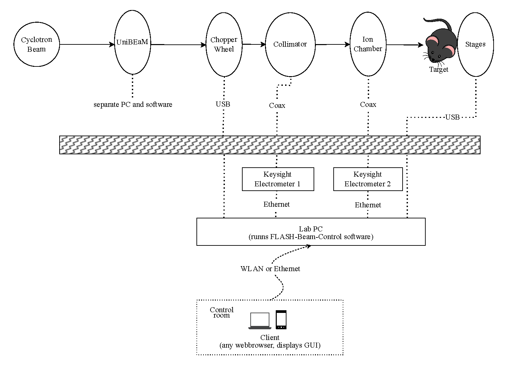
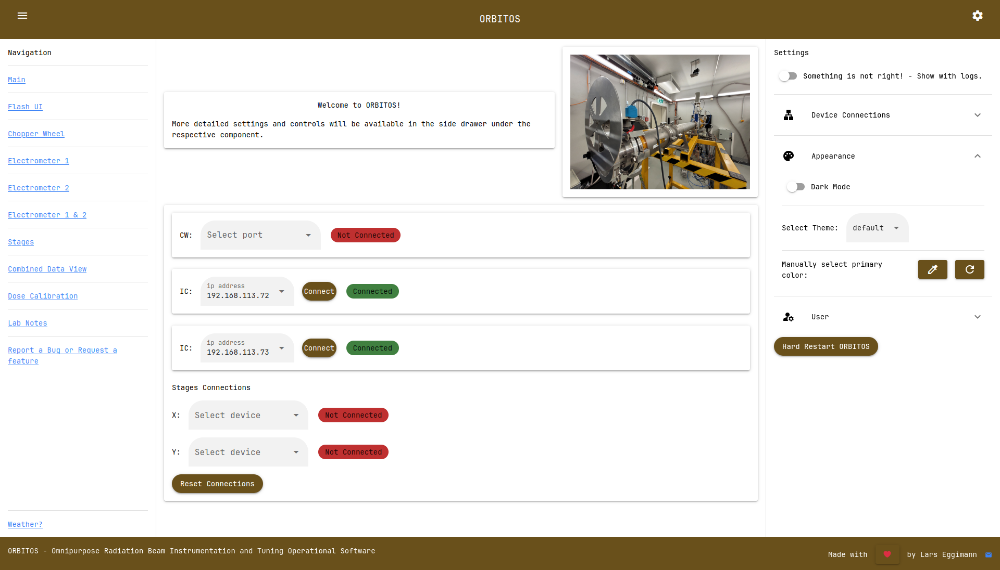
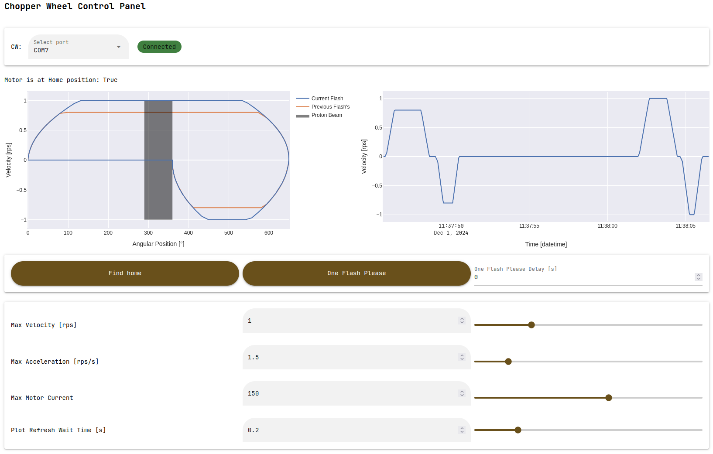
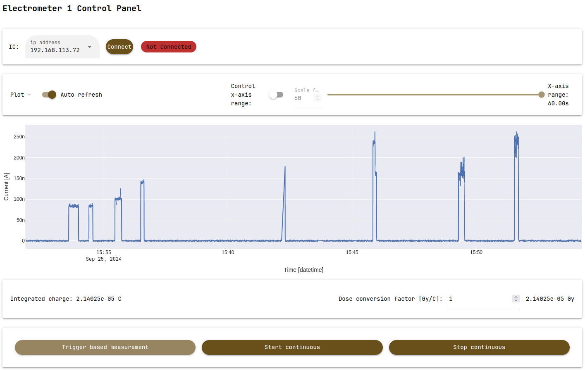
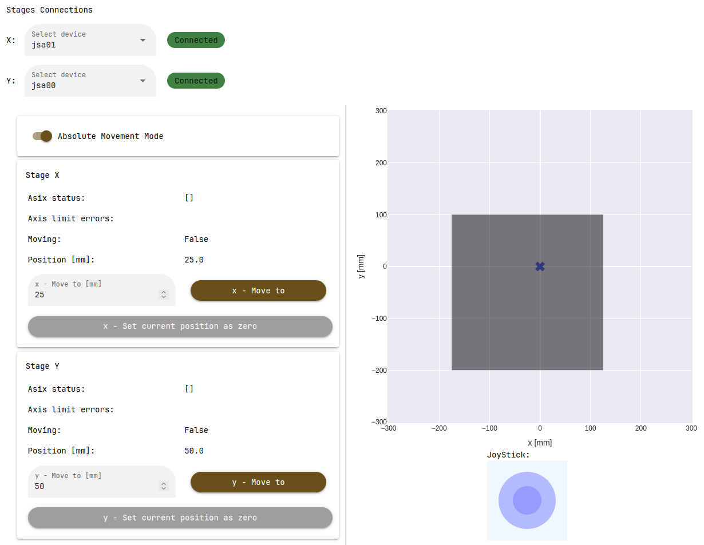
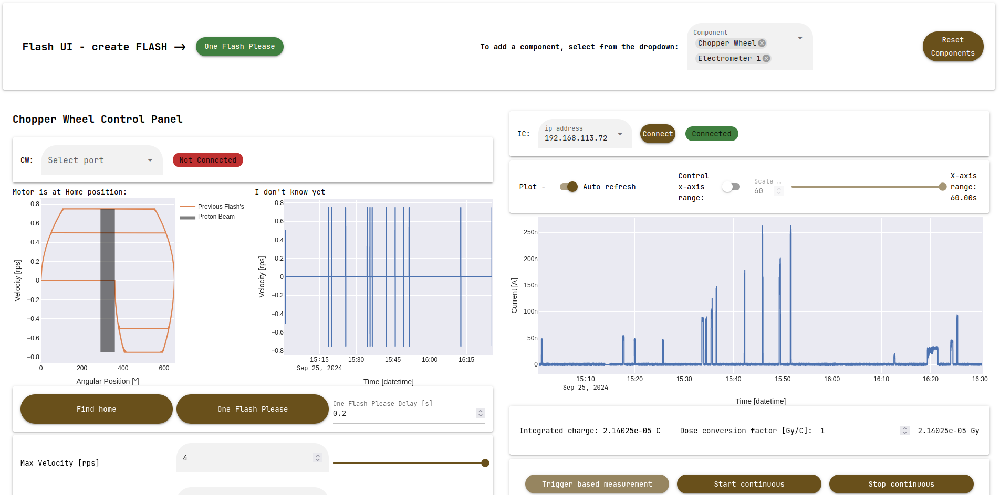
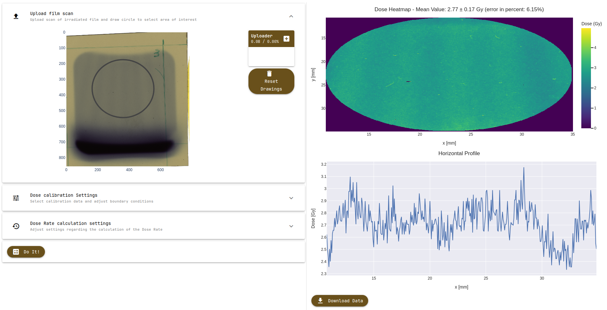
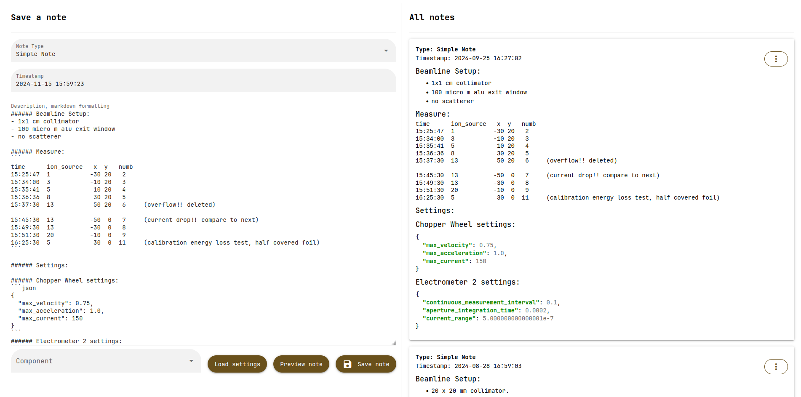
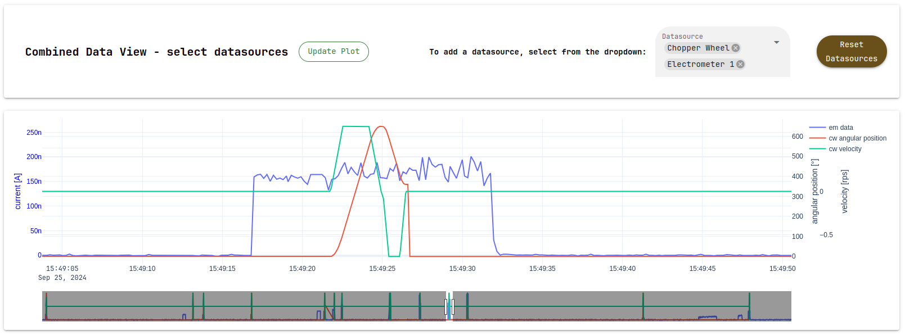
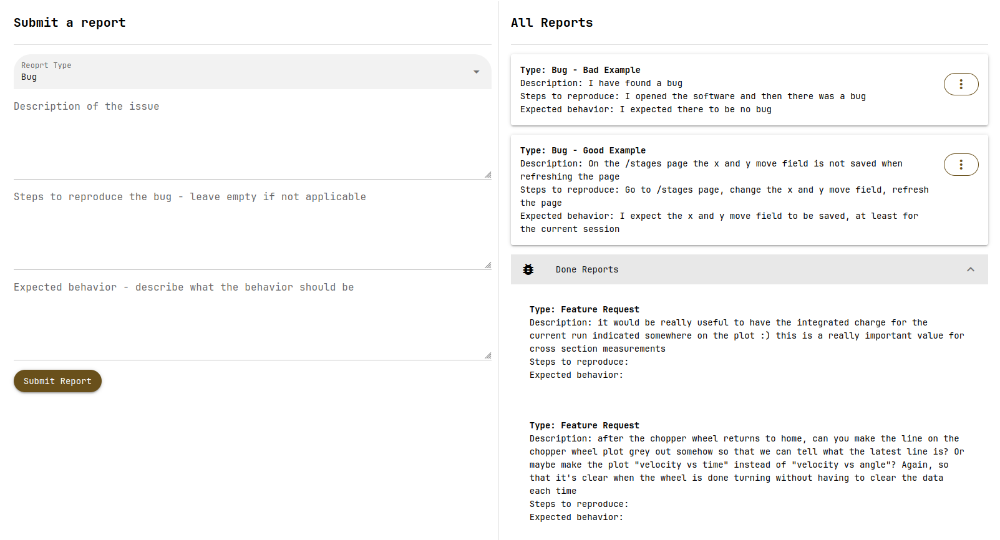

# ORBITOS ☢️
The software ORBITOS (Omnipurpose Radiation Beam Instrumentation and Tuning Operational Software) was part of my Masters Thesis at the [Laboratory for High Energy Physics (LHEP)](https://www.lhep.unibe.ch/index_eng.html) of the [University of Bern](https://www.unibe.ch/index_eng.html) working within the [Medical Applications of Particle Physics Group](https://www.lhep.unibe.ch/research/medical_applications/index_eng.html). The core purpose of ORBITOS is to improve measurement control and reproducibility for radiobiology studies using the Bern Medical Cyclotron particle accelerator. Specifically, it is used for various cell irradiation studies at ultra-high dose rates, minibeam experiments and radiation hardness studies.
        
The software successfully integrates multiple devices, including a chopper wheel and multiple electrometers, providing an intuitive and robust interface for controlling and acquiring data.

## Demo
A live demo of the software is available at [orbitos-demo](https://orbitos-demo.izzecloud.duckdns.org/main). The demo is hosted in a containerized environment, therefore all connections to the various measurement and control devices will not work. However, the UI and general layout can be explored. (To access the demo, use the following credentials: `username: lhep`, `password: topsecret`)

## Software Design

Python was chosen as a programming language for its ease of use, extensive libraries, and because it is a language that almost every researcher is at least somewhat familiar with.

ORBITOS is designed to be a web application to allow for easy access and use on any device with a web browser. The idea is to have one end-user device controlling the measurements and data acquisition, and another end-user device for positioning the irradiation targets using the 2D stages.

Unlike most modern web applications, which typically separate the front and backend into distinct services, this software merges them within a single application. This reduces complexity and improves maintainability for future users, who may have varying levels of expertise.

ORBITOS is deployed on the local laboratory PC running Windows 11 (Lab-PC), to which all devices are connected, and can be accessed by any device connected to the same network. The web app is secured by a very basic authentication system, sufficient for its purpose since it is not intended to be publicly accessible. 

The figure below shows a schematic overview of the currently integrated devices and the connections to the Lab-PC.

The UI components and the web server are provided by the [NiceGUI](https://github.com/zauberzeug/nicegui) library, which is built on top of [FastAPI](https://github.com/tiangolo/fastapi), [Starlette](https://github.com/encode/starlette), and [Uvicorn](https://github.com/encode/uvicorn).

## Features

### Login Page
The user must log in upon the first startup. This simple system prevents accidental access, with only one username and password hardcoded into the software.

### General Layout

The general layout is divided into:
- Left Sidebar: Contains navigation buttons.
- Central Content Area: Displays the page's main content.
- Right Sidebar: Includes device connection UI, appearance settings (dark mode, themes), debugging tools, and logout options.

### Main Page
After login, the user is redirected to the main page, which contains a welcome message, a picture of the BTL, and device connection UI.

### Chopper Wheel Control

The CW control page includes:
- Connection menu
- Data visualization (real-time plots)
- Device control and settings
- Data and file management UI

### Electrometer Control

The Electrometer control page includes:
- Connection menu
- Data visualization (live plots)
- Device control and settings
- Data and file management UI

### 2D Positioning Table Control

This page contains:
- Connection menu
- Settings
- Position visualization
- Device control for each axis

### FlashUI

The FlashUI page coordinates CW and electrometer controls, allowing multiple devices to be controlled simultaneously.

### Dose Calibration

This page provides dose estimations based on GAFchromic film scans and visualizes dose distribution.

### Lab Notes and Settings Saver

Users can write notes using Markdown syntax and save or import device settings.

### Combined Data View

This page displays combined data from multiple devices in a single plot for verification purposes.

### Bug Reporting

Users can submit bug reports or feature requests through this interface.

