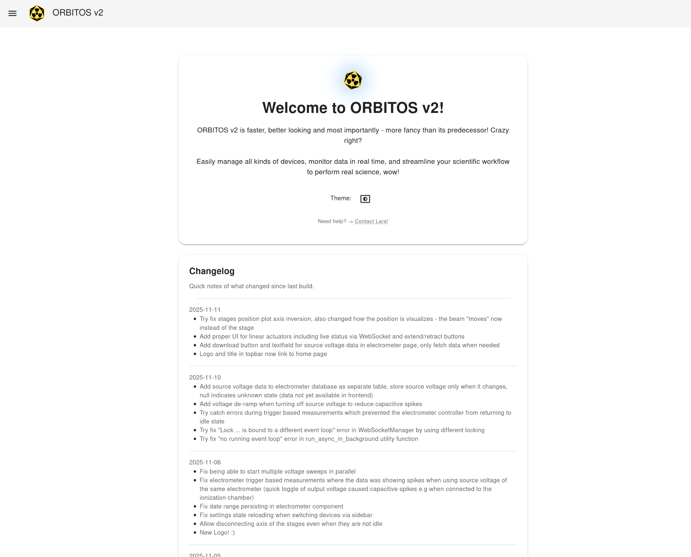
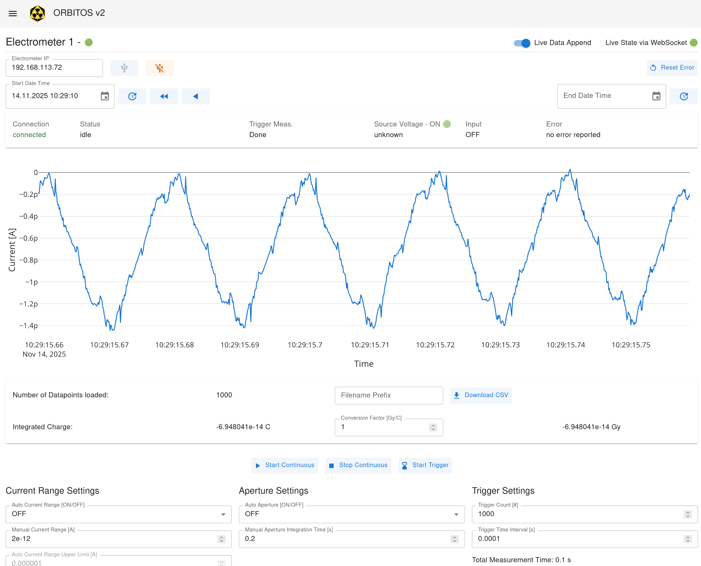
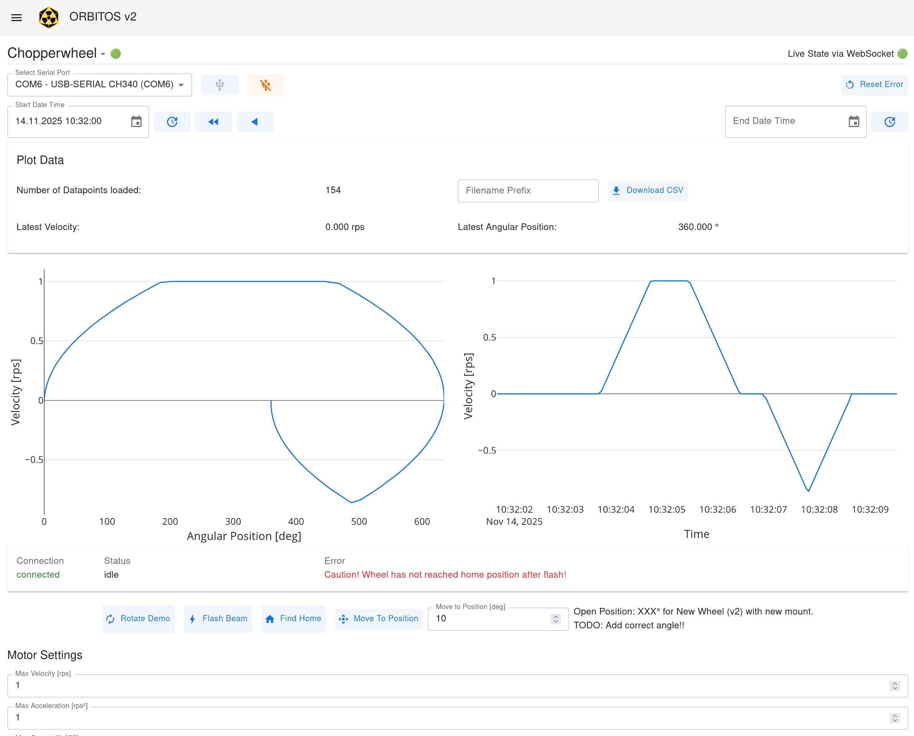
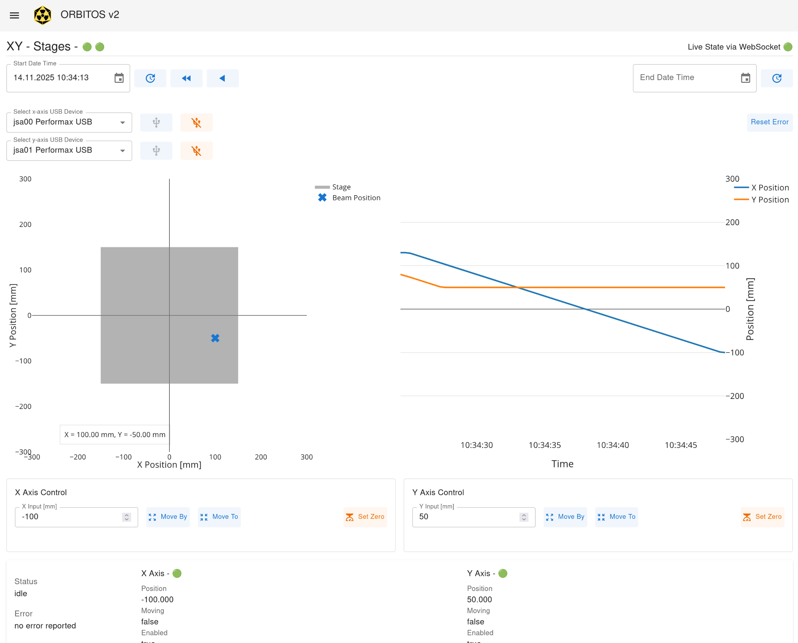
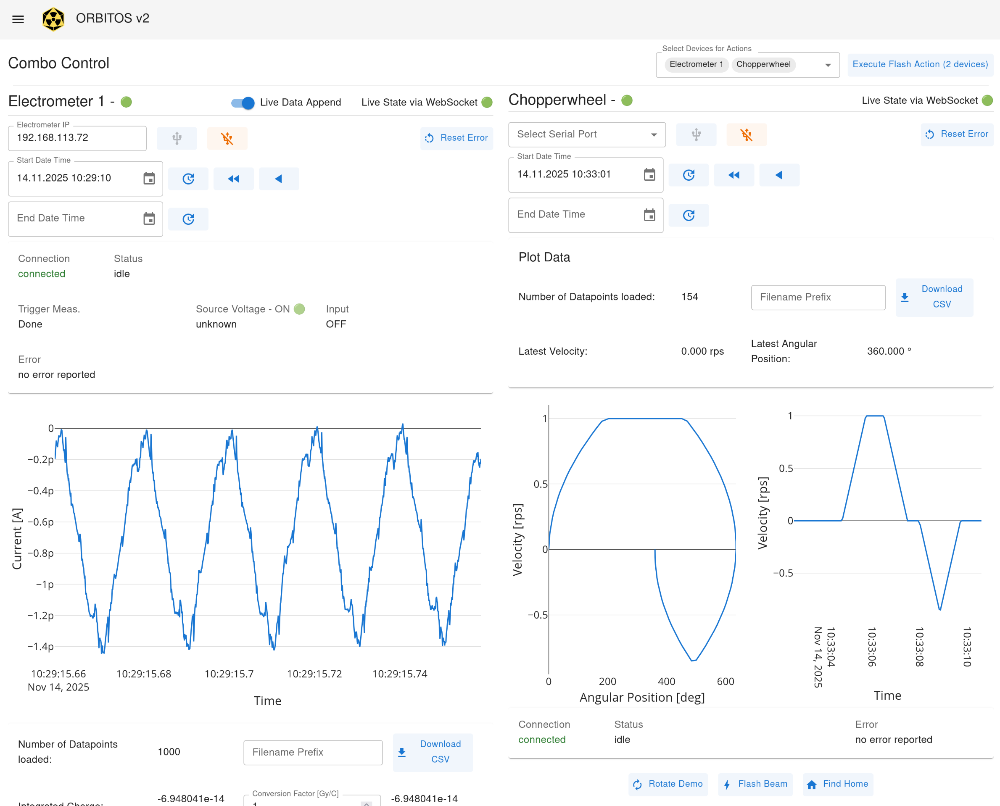
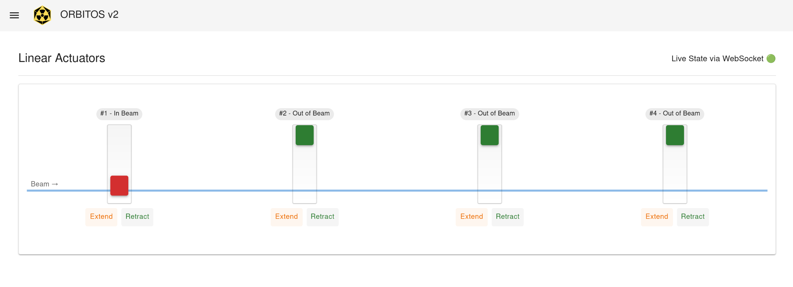

# ORBITOS v2 ☢️
The development of the software ORBITOS (Omnipurpose Radiation Beam Instrumentation and Tuning Operational Software) was part of my Masters Thesis at the [Laboratory for High Energy Physics (LHEP)](https://www.lhep.unibe.ch/index_eng.html) of the [University of Bern](https://www.unibe.ch/index_eng.html) working within the [Medical Applications of Particle Physics Group](https://www.lhep.unibe.ch/research/medical_applications/index_eng.html). The core purpose of ORBITOS is to improve measurement control and reproducibility for radiobiology studies using the Bern Medical Cyclotron particle accelerator. Specifically, it is used for various cell irradiation studies at ultra-high dose rates, minibeam experiments, cross section measurements and radiation hardness studies.

ORBITOS v2 is a complete rewrite that cleanly separates a Python backend (device control, data acquisition, data storage) from a modern React frontend (UI, state, visualization). The split makes the UI snappier and the data path simpler and faster while keeping the device integration robust and flexible using the vast Python ecosystem.
        
The software successfully integrates multiple devices, including a chopper wheel and multiple electrometers, linear actuators, etc. while providing an intuitive and robust interface for controlling and acquiring data.

Important: This software is tailored for our laboratory setup and devices used at the Bern Medical Cyclotron. ORBITOS is very designed for a specific use case and not designed for public deployment. However, the code is open source and can be adapted for other setups.

### Demo available [here](https://orbitos-demo.izzecloud.duckdns.org/)
A containerized demo version of ORBITOS v2 is reachable under this [link](https://orbitos-demo.izzecloud.duckdns.org/). Note that this demo does not work properly as the containerized backend does not connect to any real measurement devices; it only serves to illustrate the UI and basic navigation.

## Tech stack

- Backend: Python, FastAPI, SQLModel/SQLAlchemy, SQLite, WebSockets, Uvicorn
- Frontend: React + TypeScript, Vite, TanStack Router, TanStack Query, MUI (Material UI), Plotly
- API client generation: OpenAPI → typed axios client via @hey-api/openapi-ts
- Networking: Tailscale

## Architecture

- Backend exposes a versioned REST API and WebSockets under `/orbitos-api/v1`.
- Device modules encapsulate logic, routes and databases for each device: chopper wheel, electrometers, XY stages, a Raspberry Pi helper, etc.
- Application lifecycle hooks initialize/shutdown modules and the per module SQLite database.
- Frontend consumes the OpenAPI-generated client and streams live updates via WebSockets.

```
[Devices] ⇄ [FastAPI (REST + WebSockets) + SQLModel/SQLite] ⇄ [OpenAPI client] ⇄ [React UI]
```

## Features

- Device control modules
	- Chopper wheel: connect, control, state, live plots
	- Electrometers: connect, acquire, visualize time series
	- XY stages: connect, jog/position, display positions
	- Raspberry Pi helper: auxiliary device server integration
- Real-time data streaming via WebSockets (state/data/settings messages)
- Persistent per‑device settings in SQLite (via SQLModel)
- Type‑safe client calls generated from the API spec
- Robust error handling with a global exception handler
- Responsive UI built with MUI and TanStack Router/Query
- Combined data view to correlate device signals

### Screenshots
Landing page showing theme switch (dark/light) and some basic changelog information. Below are screenshots of the individual device pages and the combined view. Each device page shows connection status, control widgets and live data plots.














## Repository layout

- `backend/` — FastAPI app, device modules, persistence
	- `src/main.py` — app entry (routes, CORS, lifespan, error handler)
	- `src/modules/{chopperwheel|electrometer|xy_stages|raspi}/` — device logic + routers
	- `src/shared/` — common models, settings/state managers, websocket manager
	- `src/core/` — config, DB setup, logging
- `frontend/` — React app (Vite + TypeScript)
	- `src/generated/` — OpenAPI-generated typed client and SDK
	- `src/utils/webSocketHook.tsx` — reusable device WebSocket hook
	- `src/components/` — device UIs and plots (Plotly)
	- `public/config-*.json` — runtime API endpoint config
- `scripts/generate-clients.sh` — generate frontend client and raspi client

## Getting started

Prerequisites
- Python 3.11+
- Node.js 20+ and npm

### 1) Backend
One can use the `requirements_no_versions.txt` to avoid strict version pins and install the latest compatible versions.

```
cd backend
python -m venv .venv
source .venv/bin/activate
pip install -r requirements.txt

fastapi dev src/main.py
```

The API will be available at `http://localhost:8000`. OpenAPI docs: `http://localhost:8000/docs`.

Notes
- API base prefix: `/orbitos-api/v1`
- Local DB files are created per device module in `backend/src/modules/{module}/` (SQLite)

### 2) Frontend

```
cd frontend
npm install

# Configure endpoints (used at runtime):
#   public/config-dev.json       → development
#   public/config-preview.json   → preview/production
npm run dev
```

Default dev server: `http://localhost:3000` (see `vite.config.ts`).

Run both (Linux) with one command:
```
cd frontend
npm run linux:dev
```

Windows helpers also exist (`win:dev`, `win:preview`) and a root `launch-orbitos-v2.bat`.

### 3) Generate the typed API client (when API changes)

```
./scripts/generate-clients.sh
```

### Networking (Tailscale)

For secure access between the devices, we recommend running both the backend host and client machines on the same [Tailscale](https://tailscale.com/) tailnet. Point `API_BASE_URL` and `API_WEBSOCKET_URL` (see `public/config-*.json`) to the backend’s Tailscale IP/hostname.

## Scope and safety

This code targets a specific lab setup and device mix. It’s not hardened for internet exposure and should be used on trusted networks only.

---

Looking for [ORBITOS v1](https://github.com/LarsEggimann/orbitos/tree/main)?

The v1 monolithic app (NiceGUI-based) served as the original prototype. ORBITOS v2 supersedes it with a split backend/frontend architecture for better UI responsiveness and data handling.

